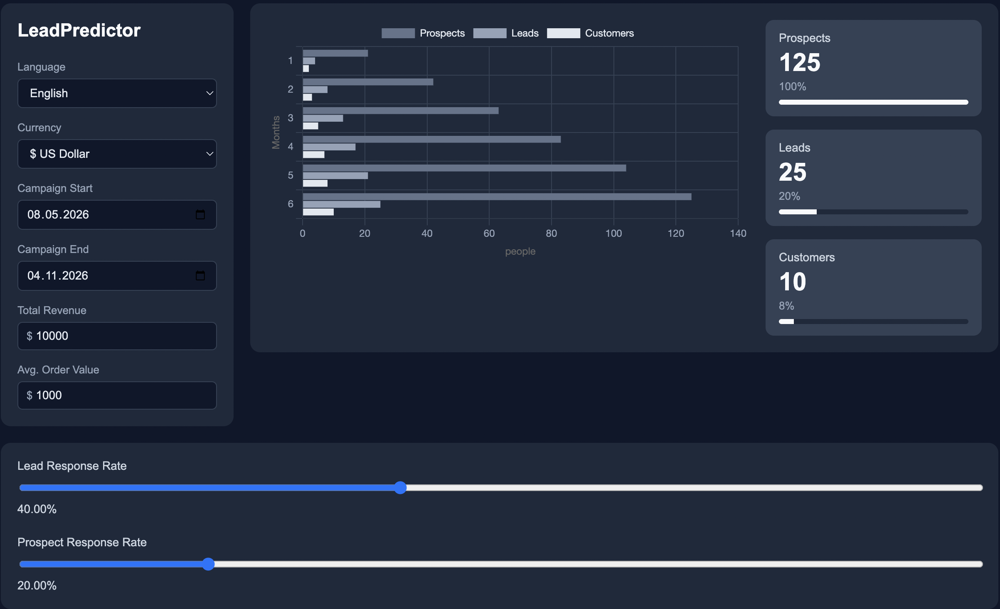

# softuni_lead_calc
SoftUni final project
---------------------

# LeadPredictor

A lead-funnel calculator that estimates how many prospects and leads
you need to hit a revenue target, based on average order value and
response rates at each funnel stage. Built to visually match a
provided reference design, with full English/Bulgarian support.

## Live Demo

https://leadpredictorcalc.netlify.app/

## Screenshot

## Formulas

**Customers**

Customers = Total Revenue / Avg. Order Value

**Leads**

Leads = Customers * 100 / Lead Response Rate

**Prospects**

Prospects = Leads * 100 / Prospect Response Rate

## Features

- Live-updating funnel calculations as you adjust inputs and sliders
- Monthly bar chart (Prospects / Leads / Customers), ramped linearly
  across the campaign duration, derived from the campaign start/end dates
- Currency symbol switches with the Currency dropdown (USD/EUR/BGN)
- Full English / Bulgarian UI translation, including chart labels and axes
- Responsive layout for narrow screens

## Running locally

Just open `index.html` in a browser — no build step or dependencies
to install. Chart.js is loaded via CDN.

## Tech

- HTML / CSS / vanilla JavaScript
- [Chart.js](https://www.chartjs.org/) (via CDN) for the funnel chart
- Deployed via [Netlify](https://www.netlify.com/), connected directly
  to this GitHub repository

## Project workflow

This project was built following a structured Git workflow:
- All changes made on feature branches, merged into `main` via pull requests
- Includes a deliberately reverted commit as part of the exercise requirements
